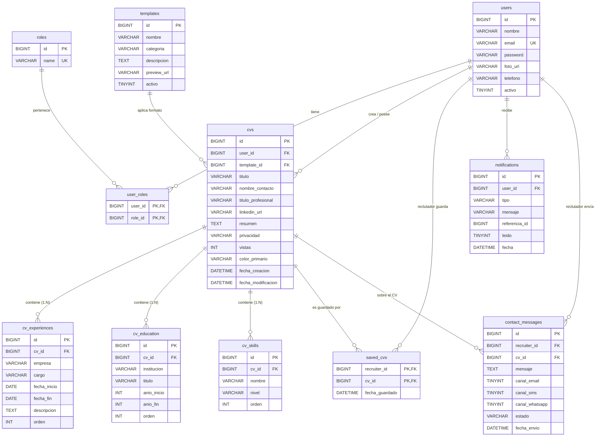

# Profolio — Plataforma Web de Gestión y Generación de CVs


---

## 1. Descripción del Proyecto

**Profolio** es una aplicación web full-stack diseñada para la **creación, edición, personalización, gestión y exportación a PDF de Currículums Vitae (CVs)** profesionalmente diseñados. 

El sistema soporta arquitectura multicapa con tres perfiles principales de usuario:
* **Usuario (Candidato)**: Crea, edita y organiza sus CVs, elige la visibilidad (pública/privada) y descarga sus currículums formateados en PDF en tiempo real.
* **Reclutador**: Consulta el directorio público de candidatos, guarda perfiles favoritos y contacta directamente a los profesionales.
* **Administrador**: Gestiona usuarios, cambia estados activo/inactivo, asigna roles y monitorea la actividad del sistema.

---

## 2. Tecnologías Utilizadas

### Backend
* **Lenguaje & Framework**: Java 17 + Spring Boot 3.4.1
* **Seguridad & Autenticación**: Spring Security 6 + JSON Web Tokens (JJWT 0.11.5) + BCrypt Hashing
* **Base de Datos & ORM**: MySQL 8.0 + Spring Data JPA / Hibernate
* **Control de Versiones de BD**: Flyway Migration (`flyway-core`, `flyway-mysql`)
* **Generación de PDF**: OpenPDF (`com.github.librepdf:openpdf:1.3.30`)
* **Integración de Correos**: Brevo API REST (Transactional Email API v3) + RestTemplate
* **Utilidades**: Lombok 1.18.38, Bean Validation (Hibernate Validator)

### Frontend
* **Framework & Bundler**: React 19 + Vite 8
* **Enrutamiento**: React Router DOM 7
* **Estilos**: Vanilla CSS modular responsive
* **Linter**: ESLint 10

### Pruebas & Herramientas de API
* **API Client**: Bruno (Colección disponible en la carpeta `/bruno`)
* **Gestor de Dependencias**: Apache Maven

---

## 3. Enlaces del Proyecto

* **Tablero de GitHub Projects**: [Ver Tablero del Proyecto](https://github.com/users/Razielksh/projects/2)
* **Prototipo de Figma**: [Ver Diseño de Figma](https://www.figma.com/proto/xPnIqrtslAQnjwEabUbHGt/CVGenerador?node-id=1-2&t=IWvM2ucSH5YxF1bu-1&scaling=min-zoom&content-scaling=fixed&page-id=0%3A1&starting-point-node-id=1%3A2&show-proto-sidebar=1)

---

## 4. Credenciales de Prueba

La base de datos se inicializa automáticamente con los siguientes usuarios de evaluación mediante Flyway (`V2__datos_semilla.sql`):

| Rol | Correo Electrónico | Contraseña | Descripción / Propósito |
|---|---|---|---|
| **Administrador (Evaluación)** | `admin@profolio.com` | `Admin123!` | Acceso total al panel de administración de usuarios. |
| **Reclutador** | `reclutador@profolio.com` | `Reclutador123!` | Acceso a CVs públicos, guardado de candidatos y contacto. |
| **Usuario Estándar** | `juan.antonio@profolio.com` | `Usuario123!` | Candidato de prueba con CV completo de Contadora Pública. |

---

## 5. Instrucciones de Instalación y Ejecución

### Requisitos Previos:
* **Java Development Kit (JDK)**: Versión 17 o superior.
* **Node.js**: Versión 18.0.0 o superior (con npm).
* **MySQL Server**: Versión 8.0 activa (vía XAMPP, MySQL Service o Docker).

---

### Paso 1: Configurar la Base de Datos MySQL
Crea la base de datos vacía en MySQL. Flyway creará la estructura y los datos de prueba automáticamente al arrancar el backend:
```sql
CREATE DATABASE profolio_db CHARACTER SET utf8mb4 COLLATE utf8mb4_unicode_ci;
```

---

### Paso 2: Ejecutar el Backend (Spring Boot)
1. Navega a la carpeta del backend:
   ```bash
   cd backend/backend
   ```
2. Ejecuta el servidor con Maven:
   ```bash
   ./mvnw spring-boot:run
   ```
   *(En Windows también puedes ejecutar `mvnw.cmd spring-boot:run` o iniciarlo desde tu IDE).*
3. El backend iniciará en `http://localhost:8080`.

> **Nota sobre el envío de correos**: Si deseas probar el envío real de emails vía Brevo, configura la variable de entorno:
> `set BREVO_API_KEY=tu_api_key_de_brevo` antes de iniciar la app.

---

### Paso 3: Ejecutar el Frontend (React + Vite)
1. Navega a la carpeta del frontend:
   ```bash
   cd frontend
   ```
2. Instala las dependencias:
   ```bash
   npm install
   ```
3. Inicia el servidor de desarrollo:
   ```bash
   npm run dev
   ```
4. Abre tu navegador en la URL mostrada (normalmente `http://localhost:5173`).

---

## 6. Diagrama Entidad-Relación (ER)

El siguiente diagrama en **Mermaid** describe el modelo relacional de la base de datos de Profolio:



---

## 7. API REST & Colección de Pruebas Bruno

* **URL Base de la API (Local)**: `http://localhost:8080`
* **Colección Bruno**: En la carpeta de la raíz `/bruno` se encuentran todas las peticiones listas para importar en **Bruno API Client**:
  * `/auth`: Login Admin, Login Reclutador, Registro.
  * `/admin`: Paginación de usuarios, Creación, Actualización, Toggle de Estado y Borrado.
  * `/cv`: Exportar PDF, Guardar/Actualizar CV, Mis CVs, CVs Públicos.
  * `/test`: Prueba de envío de emails.
  * `/environments`: Entornos preconfigurados para `local` y `vps`.
